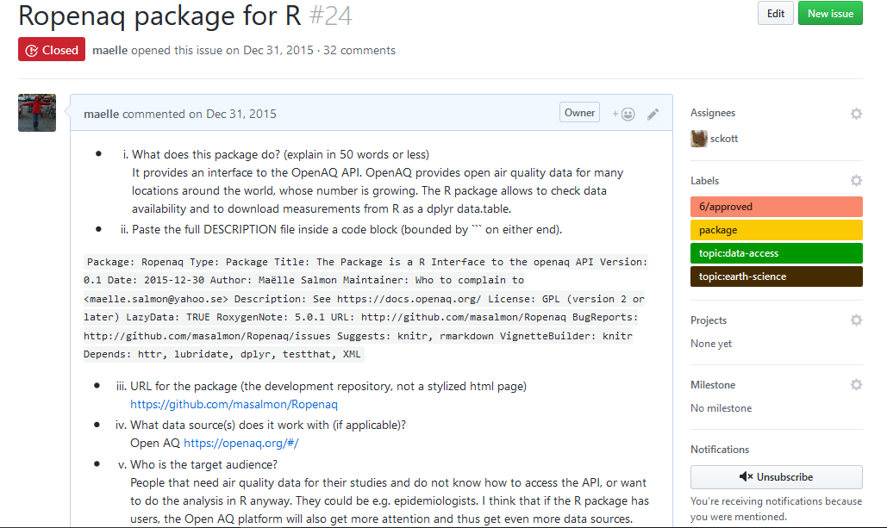

## What is rOpenSci?

* Presented in David's talk... can I quizz you?

* An organization supporting open science and reproducibility

* Packages and a community

```{r echo = FALSE, out.width = "400px"}
knitr::include_graphics("images/logo.png")
```

## Onboarding?

* Internally developed packages (Scott Chamberlain, Jeroen Ooms).

* Packages submitted by the community.

https://ropensci.org/packages/

Onboarding process: ensuring best practices in the collection of packages.

## Onboarding?

```{r echo = FALSE, out.width = "1000px"}

```

## What packages?

* __data retrieval__

* __data extraction__

* __database access__

* __data munging__

* __data deposition__

* __reproducibility__

## What packages?

* __geospatial data__

* __text analysis__

And in case of any doubt... pre-submission enquiries!

## Who?

Four editors

* Scott Chamberlain (@sckottie)

* Karthik Ram (@_inundata)

* Noam Ross (@noamross)

* Maëlle Salmon (@ma_salmon)

And many awesome reviewers!

## Submission story: `ropenaq`

* Step 1: reading old issues until I felt ready and not afraid

You don't need that step, coolest process ever!


## Submission story: `ropenaq`

* Step 2: submitting the package!

```{r echo = FALSE, out.width = "1000px"}

```

## Submission story: `ropenaq`

* Step 3: getting the reviews and making the changes

```{r echo = FALSE, out.width = "1000px"}

```

## Submission story: `ropenaq`

* Step 4: thanking the reviewers and transferring the repo

```{r echo = FALSE, out.width = "1000px"}

```

## Submission story: `ropenaq`

* Step 5: writing a blog post

```{r echo = FALSE, out.width = "1000px"}

```

## Submission story: `ropenaq`

* The package got better

* My coding skills got better

* I met nice people

What's not to love about that process?

## Why is this interesting for you?

* Submitting a package?

* Becoming a reviewer?

## Where to get more information

* The Github onboarding repo github.com/ropensci/onboarding

* Ask me anything!